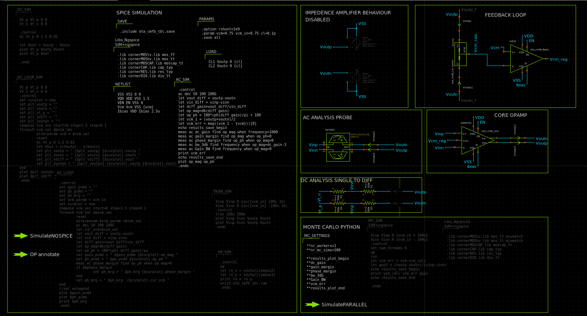

# Description
A high-performance, fully differential operational transconductance amplifier (OTA) integrated with a Monticelli class-AB push-pull output stage. Designed and simulated using the open-source IHP SG13CMOS5L process design kit (PDK).

Schema
------

Key Specifications
------------------

-   **Technology:** IHP SG13G2

-   **Supply Voltage:** 1.5V

-   **Input Common-Mode:** 0.75V

-   **Output Common-Mode Target:** 0.75V (Regulated via continuous-time CMFB)

-   **Open-Loop Gain:** ~50 dB

-   **Output Voltage Swing:** 0.1V to 1.3V (per single-ended output)

-   **Target Phase Margin:** 60° - 65°

-   **Target GBW:** 40-50 MHz

Architecture Overview
---------------------

-   **Input Core:** A 5-transistor (5T) fully differential OTA providing the primary transconductance and initial voltage gain.

-   **Output Stage:** A class-AB push-pull buffer. This architecture allows massive dynamic current delivery and wide output swings without relying on static, headroom-starved tail currents.

-   **Common-Mode Feedback (CMFB):** An active CMFB loop samples the differential outputs and biases the OTA core to securely lock the output common-mode to exactly the specified input voltage VREF.

Toolchain
---------

-   **Simulation Engine:** NGSpice

-   **Layout Generation:** KLayout 

-   **Schematic Capture:** Xschem

Running the Simulations
-----------------------

To simulate the amplifier, open the main schematic using the **Xschem** software and locate the dedicated simulation section.

-   **Toggling Blocks:** Use the **`Ctrl+T`** shortcut to enable or disable specific simulation code blocks and subcircuits.

-   **Running Standard Simulations:** Execute the `simulateNGSPICE` command by holding **`Ctrl` + clicking the green arrow**.

-   **Running Monte Carlo:** Requires a custom command detailed below.

### Simulation Configurations

Ensure only the relevant code block is enabled for your desired analysis, and all other `_SIM` blocks are disabled.

-   **AC Analysis:**

    -   Enable: `AC_SIM` (or `AC_LOOP_SIM`) and the `xprobe1` subcircuit.

    -   Disable: `Vmeas6` and `Vmeas7`.

-   **Operating Point (.OP):**

    -   Enable: `OP_SIM`.

    -   Enable any specific subcircuits you wish to evaluate.
    
    -   To annotate operating points, you need to run the command `OP annotate` after running the simulation
    

-   **Transient Analysis:**

    -   Enable: `TRAN_SIM`.

    -   Disable: `xprobe1`, `Vmeas6`, and `Vmeas7`.

-   **DC Sweep:**

    -   Enable: `DC_SIM` (or `DC_LOOP_SIM`).

    -   Enable: `Vmeas6` and `Vmeas7`.

> **Note on Loop Simulations:** Using the `AC_LOOP_SIM` or `DC_LOOP_SIM` blocks will automatically sweep the common-mode reference voltage (`vcm_ref`) from 0 to VDD.

### Monte Carlo Simulation

To run process mismatch analysis, you must swap out the standard libraries and use a parallel processing command.

1.  **Enable:** `AC_SIM`, `xprobe1`, and `Libs_MISMATCH`.

2.  **Disable:** `Vmeas6`, `Vmeas7`, and `Libs_NGSPICE`.

3.  **Run:** Do not use the standard green arrow. Execute the simulation using the command: `SimulatePARALLEL`.

